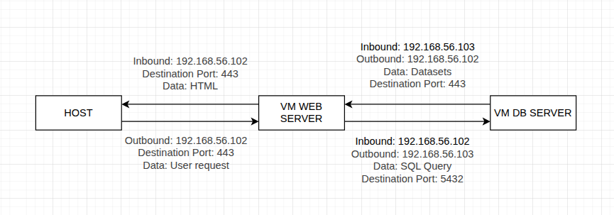
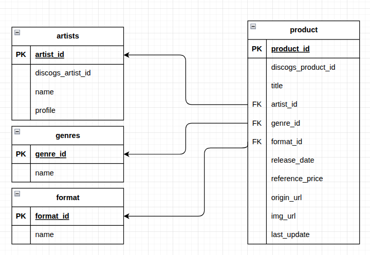
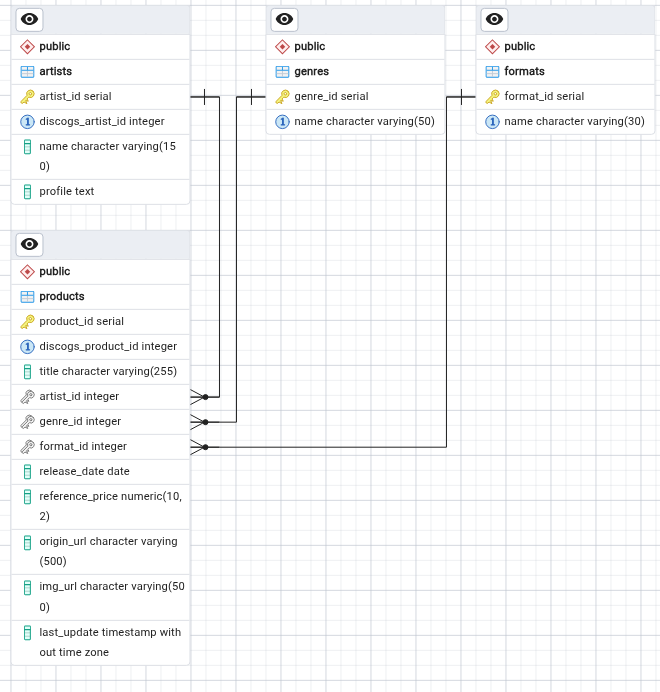
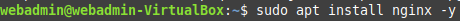
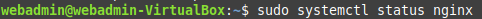
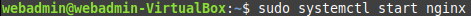
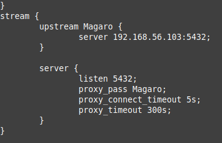

# DAY 1

## REPOSITORY CREATION AND GITHUB PAGES CONFIGURATION

The first step was initializing the repository. The name "Magaro" comes
from the first two letters of our surnames (Macías, García and Rodríguez).
We choose to add a README.md and the MIT License, since it is the most popular
and permissive license available on GitHub. We also added the file `_config.yml`
to set the initial configuration, such as the project name, the web theme and
a short description, in order to use GitHub Pages to post the project documentation.
The chosen subject for the store is music (CDs, vinyls and cassettes.) 

## API RESEARCH AND CHOSEN API

After doing a research on webs and APIs, we selected
two potential APIs for our website. These are:
- Discogs API: One of the worlds largest music database, offering detailed information abut vinyl records, CDs and even cassettes. It also features a public marketplace where users post their physical records.
- iTunes Search API: This API is officially provided by Apple. Working with this API seems to be really easy, since it doesn't need any complex authentication. However, it focuses exclusively on digital media.

We finally chose Discogs API over iTunes, since it focuses on physical market, which fits better our project. 

## WEB SCRAPING RESEARCH

In order to get ready to do web scraping, it is necessary to setup our project first. So the first step
in this process is to create and activate a virtual
enviroment. 

It is also necessary to install some libraries: `pip install requests beautifulsoup4 lxml selenium python-dotenv`

This is the recommended project structure:
```
project/
├── .env              
├── requirements.txt
├── scraper.py
├── api_client.py
└── data/
    └── output.json
```

The next step is to extract the data from the web or the API, using the libraries we already installed. Once we extracted the data, we dump them into a JSON file.

To make sure our work is ethical, we must respect the legal terms of service each website provides. This information is stored in the `robots.txt` file, so we must always check before we start working.

## HOW TO ENABLE SECURE HTTPS SERVER AND TWO-FACTOR AUTHENITACTION

To begin, we need to install the folowing web server:
`sudo apt install apache2`

The goal is to encrypt the connection between the user's browser and the server. To implement a secure server we must obtain an SSL/TLS certificate. Let's Encrpyt is a platform that provides free and open certificates. We also must install Certbot to install the certificate. 

The two-factor authenticator(2FA) adds an extra layer of security by requiring a temporary code in addition to the password. In order to enable the 2FA, we must install and enable the `mod_authn_otp` Apache module. Finally, we also must create a file to stores each user's keys.

## VM SETUP AND CONFIGURATION

We created two virtual machines based on Linux Mint(v.21.2), one for the database and the other for the web server. The first adapter is configured as NAT to allow internet access exclusively for system maintenance and downloading web dependencies

We created a second adapter for each VM configured as 'host only' so both of the VM can communicate with each other.
 
### 1. Web Server VM:
- VM Name: Proyecto linux web server
- OS: Linux Mint (64-Bit)
- RAM: 23268 MB (23GB)
- CPU: 6 cores
- Storage: 25 GB
- System User: webadmin
- Adapter 2 (enp0s8) IP: 192.168.56.102/24

### 2. Database Server VM:
- VM Name: Proyecto linux DB server
- OS: Linux Mint (64-Bit)
- RAM: 23268 MB (23GB)
- CPU: 6 cores
- Storage: 25 GB
- System User: dbadmin
- Adapter 2 (enp0s8) IP: 192.168.56.103/24

## ARCHITECTURE DIAGRAM



# DAY 2

## POSTGRESQL AND PGADMIN4 SETUP

On our website's database machine, we installed PostgreSQL, which comes pre-installed on the Linux Mint virtual machine we're using. We also installed pgAdmin 4 from the Linux Mint software manager application, set a password for its use since we'll be storing our store's database there, and the machine is now ready to use.


## FUNCTIONAL REQUIREMENTS

After studying and analyzing our website, the functional requirements were established.

### Data Acquisition
- The system must extract products information from target websites.
- The system must read and comply with the website's `robots.txt`.
- The scraping script must have a delay between requests to prevent server overhead.
- The system must store all the scraped data into a JSON file.

### Data Storage
- The system must import records into the database from the JSON file.
- The system must validate database integrity and avoid duplicate records.

### Web Development
- The system must read information from the database and inject it into the HTML document.
- The system must create HTML and CSS files ready for deployment.

### Web Presentation
- The website must display products as read-only, with no buying options or shopping cart features.
- The website must display images only using external URLs.

## RELATIONAL MODEL

Since the project structure is simple, it is possible to make the relational model without referencing a entity/relational diagram. 



## SQL DATABASE CREATION ON PGADMIN4

Looking at the relational model, we defined the database structure and we created it in PgAdmin4 by command line. We used the next SQL sentence to create it:
```SQL
CREATE TABLE artists (
    artist_id SERIAL PRIMARY KEY,
    discogs_artist_id INT UNIQUE NULL,
    name VARCHAR(150) NOT NULL,
    profile TEXT
);

CREATE TABLE genres (
    genre_id SERIAL PRIMARY KEY,
    name VARCHAR(50) NOT NULL UNIQUE
);

CREATE TABLE formats (
    format_id SERIAL PRIMARY KEY,
    name VARCHAR(30) NOT NULL UNIQUE
);

CREATE TABLE products (
    product_id SERIAL PRIMARY KEY,
    discogs_product_id INT UNIQUE NULL,
    title VARCHAR(255) NOT NULL,
    artist_id INT NULL,
    genre_id INT NULL,
    format_id INT NULL,
    release_date DATE,
    reference_price NUMERIC(10,2), 
    origin_url VARCHAR(500),         
    img_url VARCHAR(500),         
    last_update TIMESTAMP DEFAULT CURRENT_TIMESTAMP,
    

    CONSTRAINT fk_products_artists FOREIGN KEY (artist_id) 
        REFERENCES artists(artist_id) ON DELETE RESTRICT,
    CONSTRAINT fk_products_genres FOREIGN KEY (genre_id) 
        REFERENCES genres(genre_id) ON DELETE RESTRICT,
    CONSTRAINT fk_products_formats FOREIGN KEY (format_id) 
        REFERENCES formats(format_id) ON DELETE RESTRICT

```


## VIRTUAL MACHINES CONNECTION SETUP

In order to establish a functional connection between the web-server VM and the database VM, the first step is to make some changes in the postgres configuration files, in the database VM. 

### Edit `postgresql.conf`
Search for the line `listen_addresses` and change its value to `'*'`

### Edit `pg_hba.conf`
To authorize the web server IP address, it is necessary to edit the `pg_hba.conf` file, adding a new line at the end of the file with the following information:

|Type | Database | User | IP_address | method |
|-----|----------|------|------------|--------|
|host | all | all | 192.168.56.103/24 | scram-sha 256 |

# DAY 3

## NGINX INSTALL & CONFIGURATION
We installed nginx with these commands in the terminal.

1.    
2.    
3.    
  
After installing Nginx, we configure the IPs in nginx.conf. After the http block, we add a stream block with the IP address of the database machine and the port, in our case 5432.



## PYTHON API CONSUMING APP

As a initial approach, we started developing our API consuming app in a very simple way. The target was to figure out how the data coming from the API was structured. After reading the Discogs' official documentation, we came out with a simple prototype that would print a few artists' name on screen.

```python
import requests
import discogs_client
import json
from flask import Flask, render_template

artist_url = 'https://api.discogs.com/database/search?q={artist}&token={token}'

artists = ['Oasis', 'Sabrina Carpenter', 'Daft Punk', 'Laur', 'Team Grimoire', 'Akira Complex', 'Duki', 'XXXTENTACION', 'Ado']
    for artist in artists:
        target_url = artist_url.format(artist = artist)
        response = requests.get(target_url)
        data = response.json()
        artist_name = data['results'][0]['title'] 
        if FORBBIDEN_CHAR in artist_name:
            print(artist_name.split(' ')[0])
        else:
            print(artist_name)
```

The next step was to get all the other information about the artists we wanted to show in our website. After doing some research on the structure of the JSON data dumps, we got a few methods in order to decouple the code. 

```python
def info_dump(artist: str) -> dict:
    target_url = artist_url.format(artist = artist, token = DISCOGS_TOKEN)
    response = requests.get(target_url)
    data = response.json()
    artist_info = requests.get(data['results'][0]['resource_url'])
    return artist_info.json()

def get_profile_pic(artist: str) -> str:
    artist_info = info_dump(artist)
    profile_pic_url = artist_info['images'][0]['uri']
    return profile_pic_url

def get_artist_name(artist: str) -> str:
    artist_info = info_dump(artist)
    artist_name = artist_info['name']
    if FORBBIDEN_CHAR in artist_name:
        return artist_name.split(FORBBIDEN_CHAR)[0].strip()
    return artist_name

```

This code still have some issues, since it does way too much requests, but we thought it was a solid starting point.

## HTML DOCUMENT

The other step in our way to build a website is, obviously, creating a HTML document. We made a really simple landing page, getting all the data from our Python app using the Python library `Flask`.

```html
<!DOCTYPE html>
<head>
    <title>{{ main_title }}</title>
    <style>
        body {
            background-color: beige;
        }

        #containerGrid {
            width: 100%;
            display: grid;
            grid-template-columns: 3;
            margin: 5px
        }
    </style>
</head>

<body>
    <h1>This is {{ main_title }}!</h1>
    <h2>Here's our favourite's selection</h2>
    <div id="containerGrid">
        
        
        <p>{{ artist }}</p>
        
    </div>
    
</body>
```

# DAY 4

## AI SCRAPING

## HTML AND CSS DESIGN

Once the HTML template was done, making some sketches of how the website should look was the next step to take. Since this website is focused on music recommendations, the base design had 3 sections, one per group member, in which different artist would be included, with their name and picture. An 'about us' section and a footer were also added to the design. In purpose to make the design visually appealing, each section was limited by diagonal boundaries, to give the feel of dynamism. 

Also, we used Adobe Color website to get an harmonious color palette. Three colors were chosen, one for each section / group member. Finally, the font Victor Mono was also added, using the Google Fonts API.


